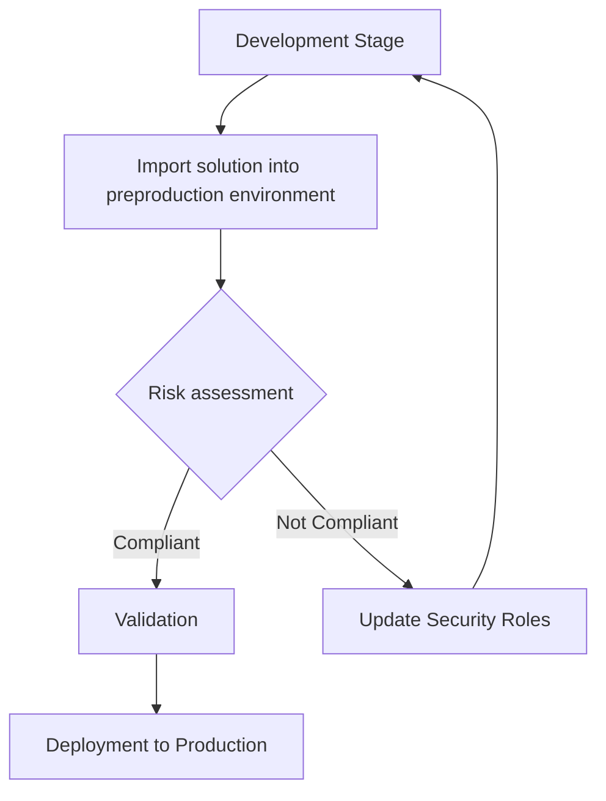

# Enhance security with automated role compliance checks

Risk assessments help identify potential weaknesses in a system before they happen, like who can access important business data and what they can do with it. They are a great tool for helping Power Platform makers and admins protect sensitive business data and mitigate issues like unauthorized access or data breaches, keeping the system safe.
Strengthen your organization's security with the risk assessment tool to monitor and evaluate custom roles in Microsoft Dataverse, the underlying security model for most Power Platform products. Ensure roles meet baseline access levels, customizable to reflect your organization’s definition of secure.

### Key features
1.	Automated scanning: Monitors all custom security roles for changes to minimize need for manual audits.
2.	Noncompliance flagging: Identifies roles that do not meet baseline policies.
3.	Customize risk tolerance: Allows tailoring of security settings to specific business needs.

## Incorporating risk assessment into the Power Platform application lifecycle

The purpose of following overview is to outline the application lifecycle process including the integration of Security Roles Risk Assessment to ensure compliance and prevent noncompliant solutions from being deployed to production.

### Application Lifecycle Process

The application lifecycle process involves several stages, starting from development, moving through testing, and finally reaching deployment. This process ensures that applications are built, tested, and deployed in a structured and secure manner.

### Security Roles Risk Assessment

The Security Roles Risk Assessment can be incorporated into development workstreams as a crucial part of this lifecycle. It involves dynamic analysis and risk assessment recommendations to streamline role management. The tool helps makers ensure that they are building the right security constructs into their solutions. It provides a comprehensive view of security roles' impact, promoting proactive and informed decision-making in access control and user provisioning.

### Scenario for makers

In a typical scenario, makers develop their solutions in a separate environment. When a solution is ready to be shipped, it is brought to a deployment team for review. This team then imports the solution into a preproduction environment for further validation.

### Preproduction Environment

The preproduction environment plays a critical role in validating the solution's security roles. It allows for the assessment of security roles against predefined risk assessment settings. For instance, if a security role grants critical privileges like creating or deleting accounts at an organization level, it is flagged for review. The risk assessment tool evaluates these roles and provides a compliance status.

### Validation Blocker

If the risk assessment identifies any level of noncompliance, it acts as a validation blocker, preventing the solution from being deployed to production. This ensures that only compliant solutions, which adhere to the principle of least privilege and other security guidelines, are moved to the production environment.

By incorporating these steps, the application lifecycle process ensures that security roles are properly managed and validated, reducing the risk of security breaches and ensuring compliance with organizational policies.

### Mermaid Flowchart

Here is a mermaid flowchart demonstrating the application lifecycle process with a boolean split for the risk assessment process:

In this flowchart:
- The process starts at the **Development Stage**.
- The solution is then moved to the **Preproduction Environment**.
- A **Risk Assessment** is conducted.
  - If the solution is **Compliant**, it moves to **Validation** and then to **Deployment to Production**.
  - If the solution is **Not Compliant**, the app owner must **Update Security Roles**, and the process returns to the **Development Stage**.
   
## Get started

To get started with the risk assessment tool, follow the steps below:
1.	[Install the Power CAT Toolkit in a Dataverse environment](./SETUP.md)
2.	Set your risk tolerance preferences
3.	Decide whether to enable auto-scan or perform manual scans
4.	Provide access and instructions to app owners and integrate into development pipeline
 
## Personas and permissions

Understand the two main personas' roles and responsibilities to effectively use the risk assessment tool.

### App owner

The app owner is the maker who submits their solution for evaluation, so it can be used in a production environment with signoff from the admin. They must conform to the threat tolerance of the company and adjust privileges as needed, or coordinate with the admin team to request exceptions where necessary.

•	Responsibilities: Ensure compliance of managed roles, address noncompliance issues.

#### Environment admin

The admin oversees the security of the production environment, and often times is in a tenant admin role, therefore the responsibility of the business' data security often rests with this team. They must review and filter out threats, which is why it's common for admins to take a defensive security posture. They can allow exceptions if they are closely monitored, but they broadly define the default threat tolerance that applies broadly. They may manually coordinate with individual cases to approve or reject special requests. They may also choose to configure auto-scan settings to proactively allow the for scans, or they may choose to periodically manually scan all roles.

•	Responsibilities: Ensure security compliance within the environment, configure setup and threat tolerance settings, and manage all role assessments in a way that accomodatees their workstream preferences.

## Configure settings

The risk assessment tool uses a settings profile to determine threat tolerance. One "default" settings profile is created on the first run of the app, which should be reviewed and adjusted to meet your company's preferences. The default settings are used to scan all new and edited roles in the environment.

1. On the dashboard, click the Review settings button in the card
1. Review the current default settings, which is presented in a grid of dropdowns for each intersection between a privilege type and an access level.
1. Each dropdown represents the associated risk for a given privilege type and access level combination
    > Example: the top left-most dropdown defines the risk associated with a create type privilege at the organization level. Since an organization level means
    > 

1. Define the appropriate risk levels (Critical, High, Moderate, Low, or No risk) for each privilege category at each access level. This is where you ensure the values reflect the desired risk tolerance for your organization for that type of privilege.

#### Key components of settings

| Components | Definition |
| ---------- | ---------- |
| Privilege level | Specifies the actions (such as read, write, delete) that are allowed for various data entities within the Dataverse environment. Baseline settings indicate which privileges are appropriate for each role. |
| Access scope | Defines how much data a role can access, such as organization, business unit, or user levels. Baseline settings ensure roles have appropriate access based on their purpose. |

Multiple profiles can be configured if needed. For example, if a role needs more liberal or restricted types of permissions, you might want to make a settings profile that adheres to that standard. The settings can be adjusted on the risk assessment screen, after the role has been scanned at least once.

### Auto-scan setting
Auto-scan continuously monitors roles by triggering a scan when a custom role is created or updated. Admins can choose to enable this feature, or leave it disabled and run manual scans periodically instead. Only system administrators can toggle this feature.

#### Toggling auto-scan

Admins can disable continuous scanning and opt for periodic manual scans.
  1. Locate the auto-scan settings (found on the security roles screen and settings screen under the "app settings" tab).
  2. Toggle the auto-scan feature to the off position.

#### Manual scans
This option is available for users who prefer not to use continuous scanning. If continuous scanning is enabled, manual scans are unnecessary. 

- Admins can scan all roles manually
- App owners can scan roles they own individually

## What risks does an assessment identify?

During a scan, privileges are compared to baseline policies and categorized by risk. This process ensures roles meet minimum security standards and do not pose undue risk. The minimum security standards are defined by the risk assessment settings that can be configured to meet the customer's threat tolerance.

#### Risk levels

Risk level classification assesses deviations to prioritize roles requiring urgent review. Only 'no risk' explicitly indicates 'Compliance' with policy.

| Risk Level | Description |
| - | - |
| Critical Risk | Roles far exceeding baseline policies, posing high security threats. |
| High Risk | Roles with several severe deviations from baseline policies. |
| Medium Risk | Roles with moderate deviations posing some risk. |
| Low Risk | Roles with minor deviations posing minimal risk. |
| No Risk | Roles fully compliant with baseline policies, posing no risk. |

#### Assessment states

The "Assessment State" status field on the Risk Assessment indicates the current stage of evaluating security roles within Microsoft Dataverse. Each state represents the compliance status and required action.

| **Status**       | **Description**                                    |
|------------------|----------------------------------------------------|
| Not scanned | Role has not been scanned.                                    |
| Pending          | Scan is queued.                                    |
| In Progress      | Scan is currently running.                         |
| Needs Review     | Noncompliance detected, requires action.           |
| Compliant        | All privileges meet baseline policies, no action required.             |
| Stale | Role has been changed since the last scan (if auto-scan is off). | 

### Compliance

A custom role gets a 'Compliant' status if all privileges are no risk. If any privilege has higher risk, the role gets a 'Needs review' status.

#### Actions for admins

If a role is marked as 'Needs review', use your discretion on whether to allow the role to continue in the application lifecycle (whether that's deployment to production, or if this is a production environment whether the role needs to be adjusted to match your threat tolerance levels). 

#### Actions for app owners

If a role is marked as ‘Needs review’, it is considered non-compliant and carries some risk based on the threat tolerance defined in the settings. There are two actions the user can take to address the non-compliance status:
•	Set privilege levels to baseline requirements.
•	Request exceptions if needed.
