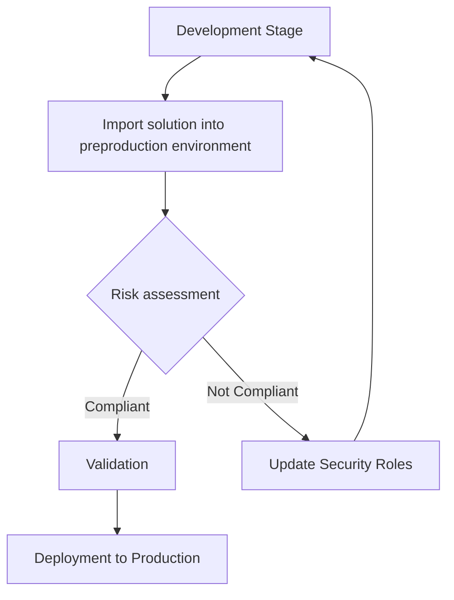

# 🔐 Automated risk assessment compliance scanning

The **Risk Assessment** feature in Power CAT Tools helps organizations evaluate and mitigate potential security risks associated with custom security roles in Microsoft Dataverse. By scanning roles against defined risk policies, it ensures that solutions comply with your organization's security standards—such as the principle of least privilege—and reduces the chances of over-permissioned roles making their way into production environments.

## Key Features

- **Automated Scanning**  
  Automatically detects and evaluates changes to security roles, minimizing the need for manual reviews.

- **Noncompliance Alerts**  
  Notifies you when roles exceed defined risk tolerance levels.

- **Customizable Risk Settings**  
  Administrators can define what combinations of privileges and access scopes are acceptable, critical, or high risk.

## Getting Started

To begin using the Risk Assessment tool:

1. **Install Power CAT Tools**  
   Deploy the solution to the desired Dataverse environment.

2. **Configure Risk Settings**  
   Define what levels of privilege (e.g., Read, Write, Delete) and scope (e.g., Global, Business Unit, User) are allowed and assign risk levels to combinations.

3. **Enable Scanning**  
   - **Auto-Scan**: Evaluates roles in real-time as they are created or updated.  
   - **Manual Scan**: Available for ad-hoc role reviews or batch assessments.

4. **Train Key Users**  
   Ensure app makers and environment admins understand how to interpret scan results and resolve noncompliance.

## User Roles and Responsibilities

- **App Makers & Owners**  
  - Create solutions and assign security roles.  
  - Respond to risk alerts by adjusting roles or requesting exceptions.

- **Environment Administrators**  
  - Define risk settings and update them as needed.  
  - Review flagged roles and approve exceptions if business-justified.  
  - Maintain scanning configurations across environments.

## Configuring risk settings

Risk settings, also known as the **risk baseline**, are the foundation of the assessment engine. They define what combinations of privileges and access scopes are considered acceptable or risky within your organization’s context. This is where you define your own threat tolerance.

A **risk baseline** covers **all types of privileges**, including:

- **Table-level privileges**: Create, Read, Write, Delete, Append, Append To, Assign, Share (e.g., on `account`, `contact`, `custom tables`).
- **Non-table (miscellaneous) privileges**: Platform-wide capabilities like "Bulk Delete", "Manage User Roles", "Publish Customizations", etc.

Each privilege is assessed in conjunction with its **access scope**, which can be:

- **Global** (organization-wide)
- **Deep** (parent-child business unit)
- **Local** (single business unit)
- **Basic** (user-level)
- **None**

You can assign a **risk level** to each privilege/scope pair:

- ✅ No Risk  
- 🔵 Low Risk  
- 🟡 Medium Risk  
- 🟠 High Risk  
- 🚨 Critical Risk

### Example Use Cases

| Privilege                         | Scope   | Assigned Risk |
|----------------------------------|---------|---------------|
| Read on `account`                | Global  | Medium Risk   |
| Delete on `contact`             | Local   | High Risk     |
| Bulk Delete (misc privilege)     | Global  | Critical Risk |
| Assign on `custom_project`       | Basic   | Low Risk      |

### Multiple Baselines

You can create and maintain multiple risk baselines to reflect different risk tolerances for different scenarios. For example, management or elevated privileges, internal vs external (portals), and so on.

Environment admins can switch which baselines are the default profile as needed.
Here’s an expanded and clearer version of the **“Assessment Scans”** section with an added status table that explains each stage and recommended actions:

---

## Assessment Scans

Once you’ve configured your risk settings (baseline), you can perform **assessment scans** on security roles within an environment. These scans compare each role’s privileges and scopes against your risk baseline and flag any discrepancies that could pose a risk to your business.

Assessment scans help you:

- Understand **how each role stacks up** against your defined risk tolerance.
- **Quickly identify roles** with excessive or out-of-scope privileges.
- Drive **remediation planning** by pinpointing exact risk factors.

### How It Works

1. **Load Roles**: The tool fetches all security roles from the selected environment.
2. **Compare Privileges**: For each role, it cross-references all privileges (including both table-level and non-table capabilities) with your configured risk baseline.
3. **Score the Role**: Each privilege is scored based on its assigned risk level (None, Low, Medium, High, Critical).
4. **Summarize Risk Profile**: The role is given an overall risk summary, and flagged if it includes any privileges that exceed your acceptable risk threshold.
5. **Save Results**: The tool stores results for further review, export, and auditing.

You can **re-scan** roles at any time, particularly after making changes to your risk baseline or if roles have been updated.

### Understanding Scan Statuses

Each scan and each role receives a **status** to help you track progress and next steps. Here's a breakdown:

| Status              | Description                                                                 | What to Do                                                                 |
|---------------------|-----------------------------------------------------------------------------|----------------------------------------------------------------------------|
| `Not Started`       | The scan hasn’t been initiated yet.                                          | Click **Scan Roles** to start the risk assessment.                         |
| `In Progress`       | The scan is currently running.                                               | Wait for it to complete. No action needed.                                 |
| `Completed`         | The scan is done, and results are available.                                 | Review roles flagged with high or critical risks.                          |
| `Out of Date`       | The scan results are no longer valid because the baseline or roles changed.  | Re-run the scan to get updated results.                                    |
| `Missing Baseline`  | No risk baseline is configured, so no scan can be run.                       | Go to **Configure Risk Settings** and set up a baseline first.             |
| `Partial Results`   | Some roles were scanned, but others encountered errors or were skipped.      | Review scan logs and consider re-running for the affected roles.           |

### Tips

- Always ensure you have the **latest baseline configured** before scanning.
- Use **filters and sort** on the results page to focus on roles with **Critical** or **High** risk items first.
- Export the scan report for compliance documentation or internal security reviews.

## Understanding Risk Levels

The tool assigns one of the following levels to each role based on how its privileges align with your configured risk settings:

- **Critical Risk**  
  Role contains excessive privileges or scopes far beyond acceptable levels.

- **High Risk**  
  The role includes multiple violations or a particularly dangerous permission.

- **Medium Risk**  
  Moderate but concerning issues, such as elevated privileges in a scoped area.

- **Low Risk**  
  Minor deviations from policy; may be acceptable in some cases.

- **No Risk**  
  Fully compliant. Role fits your defined security policies exactly.

ℹ️ **Only roles assessed as "No Risk" are considered compliant and ready for production.**

## Integrating Risk Assessment into the App Lifecycle

The Risk Assessment tool is designed to seamlessly support your secure app development process. Here's how to embed it across stages of the ALM lifecycle:

1. **Development**  
   Developers build the app and define initial security roles in a dedicated environment.

2. **Preproduction Testing**  
   The solution is imported into a test or staging environment. Roles are reviewed using the Risk Assessment tool.

3. **Assessment Phase**  
   - Run scans on all custom roles.  
   - Review flagged issues.  
   - Revise or request exception approvals for roles with risks.

4. **Approval Gate**  
   Only roles evaluated as "No Risk" can proceed to deployment. Admins can approve exceptions in special cases.

5. **Production Deployment**  
   The secure, reviewed, and approved solution is deployed to production, ensuring only compliant roles are introduced.

## Limitations

- This tool only scans roles in the current environment it's installed in. We are currently releasing the tool for environment level feedback on the experience, which will help us prioritize tenant level plans.

### Flowchart

Here is a flowchart demonstrating the application lifecycle process with a boolean split for the risk assessment process:

